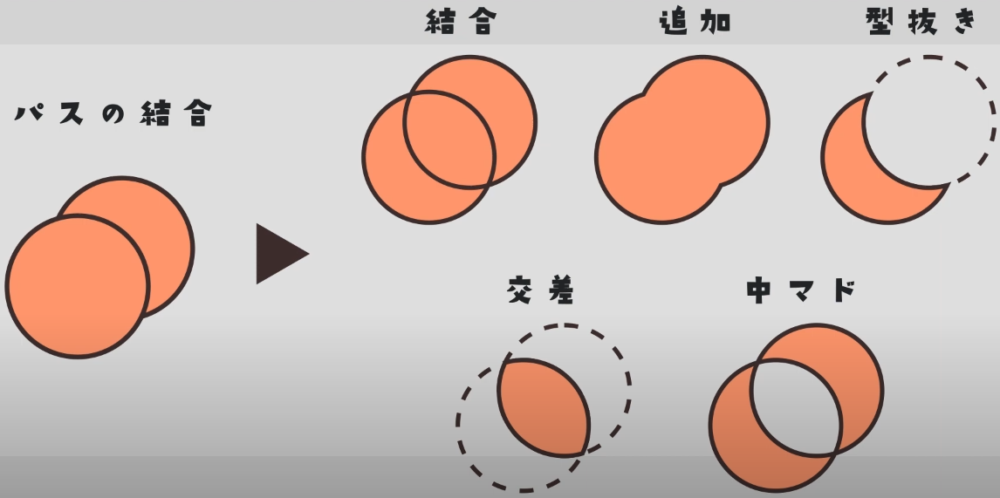

# AE使用记录

以前零零散散学了一些，快速实践了一些特效，尤其是mmd的伪3d用的比较多。现在打算认真系统地学一下，目标是达到熟练高效地做文字特效，从而配合音乐做PV的水平。

## 快捷键

- `home`：时间轴回到初始
- `n`：输出结尾设为当前位置
- `u`：收起当前layer参数
- `'`：显示中心点
- `y`：选择anchor
- `ctrl + home`：shape layer刚画出来时，锚点anchor移动到画面中心。
- `ctrl + alt + home`：锚点移到layer的中心。
- `ctrl + d`：layer复制
- `ctrl + '`：展示网格grid
- `ctrl + shift +  '`：grid 吸附

## 遇到的问题
- 崩溃后再打开时，移动时间轴光标，画面没有变化或者黑屏，重启电脑则解决。

## 教程

打算从[PuttiMW](https://www.youtube.com/@PuttiMW)这个频道作为主线，讲解是女声，比较容易入耳。
- [x] #01 这个视频是一些界面介绍，我已经掌握，没有太多可说的。
- [x] #02 设定相关。缓存盘用SSD。右侧的panel可以solo模式，点开新的旧的关闭。
- [ ] #03 shape layer相关
  - [x] 关于'fill'和'Stroke'的一些操作。双击椭圆形能创建出 elipse的锚点位置和位置都是0的圆，这样能保证shape layer的锚点位置和elipse的相同都是0。可能这里需要阐明。'fill'涂和'Stroke'线都能分开展示。
  - [x] 关于pen tool：view-snap to grid 可以吸附在格子点上。时刻注意锚点是否在中间，用y选择锚点。这影响整体变化时的情况。练习trim path的start和end的动画和repeater的复制方法。
  - [x] 添加动画merge path，mode里有几种：merge add subtract intersect

    
  - [x] morphing 主要原理是改变一个shape后，可以右键elipse选择convert to bezier path，然后把不同的形状的东西复制到另一个形状的时间轴上不同点，完成变化。
  - [x] 线的offset里有很多功能，这次试了下copy的功能，做出了涟漪的效果。
- [ ] #04
- [ ] #05
- [x] #06 关于导出设置，`B` 确定范围开头 `N` 确定范围结尾。
  - 渲染队列（在AE内渲染）：视频中用了 `QuickTime - Apple ProRes 422HQ` （我只尝试`QuickTime - 动画`，体积比较大）
  - 创建模板：点击输出模块三角形，保存设置模板。
  - 关于alpha视频的渲染设置：目前用不上先不管。
  - 另一种渲染mp4，导出到 `Adobe Media Encoder` 渲染。适合 `H264` ，试了下默认的，质量、大小和渲染速度都比较合适。渲染时内存占用不高，可以干别的，推荐。（如果报错，可以直接打开AME导入AE项目选择合成）

## 脚本

**批量导入脚本**：试用了几款，最后从插入方便，简洁等角度选择了Transcriptive SRT Importer

**自动截取声音片段**：VØID - Silence Remover 可以选择是否保留空隙，反转。
- 参数经验：padding越大保留两侧越多；tolerance越小声音越多 `13, 0.6` 比较好。

**去除空隙**：removeGap.jsx 可以去除空隙，目前执行单次，不能连续执行。

## 各种专题

### BPM
想实现输入一个BPM，然后某个layer能在每个hit处进行动画。目前的实现方法是：利用 [Tempo Marker Creator](https://note.com/iribo/n/n4a43ac1ab338) 脚本输入BPM生成一个布满标记的solid。之后，例如我想要 layer1 的图形在x轴移动的动画在每次遇到标记都做一遍。则在在做好动画后， `alt+左键` x position，脚本：
```
var otherLayer = thisComp.layer("Tempo Markers (131 [bpm] / 4 / 0 [s])"); // 获取另一个名为 "name" 的 layer
var marker = otherLayer.marker;
var n = 1;
var nearestMarkerIndex = null;

// 寻找最近的标记
for (var i = 1; i <= marker.numKeys; i++) {
    var currentMarkerName = marker.key(i).comment;
    if (currentMarkerName.match(/^\d+_\d+$/)) { // 检查标记名称是否符合 "1_1" 格式
        if (nearestMarkerIndex === null || Math.abs(marker.key(i).time - time) < Math.abs(marker.key(nearestMarkerIndex).time - time)) {
            nearestMarkerIndex = i;
        }
    }
}

if (nearestMarkerIndex !== null) {
    n = nearestMarkerIndex;
}

var t = time - marker.key(n).time;
thisProperty.valueAtTime(t);

```

其中匹配的内容根据具体情况修改，这个脚本是我根据 [这个频道](https://www.youtube.com/watch?v=IOoj3t6vhwU) 提供的：
```
n = marker.nearestKey(time).index;
if (time < marker.key(n).time){
n = n-1;
}
if(n==0){
n = 1
}
t = time - marker.key(n).time;
thisProperty.valueAtTime(t)
```
修改的。注意，我并没有完全理解，初试时动画关键帧的位置or距离会影响能否正常显示，应该是chatgpt改得不够好。